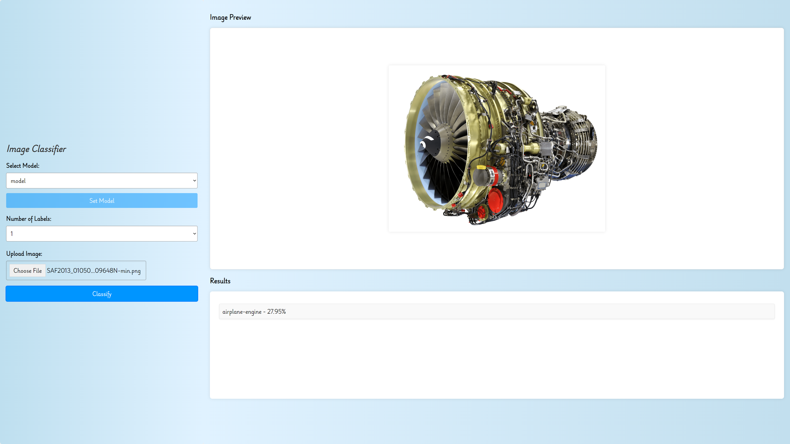

# Image-classification

[](https://github.com/1red0/image-classification/actions/workflows/build-docker-image.yml)

[](https://github.com/1red0/image-classification/actions/workflows/unit-tests-backend.yml)

[](https://github.com/1red0/image-classification/actions/workflows/unit-tests-frontend.yml)

A image classification model written in Python using Tensorflow

## Instructions

### Python

Install dependencies `pip --no-cache-dir install -r requirements.txt`

#### create_model_cli.py

```text
usage: create_model_cli.py [-h] --model_name MODEL_NAME [--data_dir DATA_DIR] [--epochs EPOCHS]
                       [--batch_size BATCH_SIZE] [--img_height IMG_HEIGHT] [--img_width IMG_WIDTH]
                       [--validation_split VALIDATION_SPLIT]

Train a deep learning model for image classification using TensorFlow.

options:
  -h, --help            show this help message and exit
  --model_name MODEL_NAME
                        Name of the model (required)
  --data_dir DATA_DIR   Path to the dataset directory (default=data)
  --epochs EPOCHS       Number of epochs to train the model (default=15)
  --batch_size BATCH_SIZE
                        Batch size (default=32)
  --img_height IMG_HEIGHT
                        Processing height of the images (default=256)
  --img_width IMG_WIDTH
                        Processing width of the images (default=256)
  --validation_split VALIDATION_SPLIT
                        Validation split (default=2e-1)
```

#### classify_cli.py

```text
usage: classify_cli.py [-h] --model_name MODEL_NAME --image_path IMAGE_PATH [--top_k TOP_K] [--img_height IMG_HEIGHT]
                   [--img_width IMG_WIDTH]

Image classification script

options:
  -h, --help            show this help message and exit
  --model_name MODEL_NAME
                        Name of the model (required)
  --image_path IMAGE_PATH
                        Path to the image (required)
  --top_k TOP_K         Number of classes to display (default=3)
  --img_height IMG_HEIGHT
                        Processing height of the image (default=256)
  --img_width IMG_WIDTH
                        Processing width of the image (default=256)
```

### Webapp

#### Starting the webapp with Python

Run `python server.py`

#### Starting the webapp with Docker

First build the image: `docker build -t image-classifier-app .`

Running the container using docker run: `docker run -p 5200:5200 image-classifier-app`

Running the container using docker-compose: `docker-compose up -d`

#### Interface


The application can be accessed from: `http://localhost:5200/`

#### Using the API

Parameters:

```text
top_k=n -> the number of n classes to show

file=@path_to_image -> the image path
```

Using curl from the CLI: `curl -X POST -F file=@path_to_image "http://localhost:5200/classify?top_k=n"`

Using curl and jq from the CLI: `curl -X POST -F file=@path_to_image "http://localhost:5200/classify?top_k=n" | jq .`

Output for the API response (Example for top_k=3):

```json
{
    "classifications": [
        {
            "class": "class1",
            "confidence": 00.00
        },
        {
            "class": "class2",
            "confidence": 00.00
        },
        {
            "class": "class3",
            "confidence": 00.00
        }
    ]
}
```
